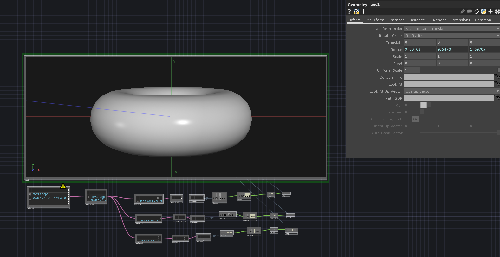

# TouchDesigner Android Controller Demo-1

This project is a basic demo for TouchDesigner's DAT plugins. By using this project you will be able to control your TouchDesigner with your mobile phone (Android)

### Prerequisites

* [Android Studio](https://developer.android.com/studio) - Sender
* [Touch Designer](https://derivative.ca/) - Receiver



### Installing

* Compile project on Android Studio
* Open .toe file on TouchDesigner
* Set your IP inside Udp DAT plugin properties in .toe project

```
for example: 192.168.1.4
```

* Set your Port inside Udp DAT plugin properties to be same as defined in Android projecy

```
for example: 9997
```


## Authors

* **İbrahim Sefa TUNA** - Android Developer

## License

This project is licensed under the MIT License - see the [LICENSE.md](LICENSE) file for details
